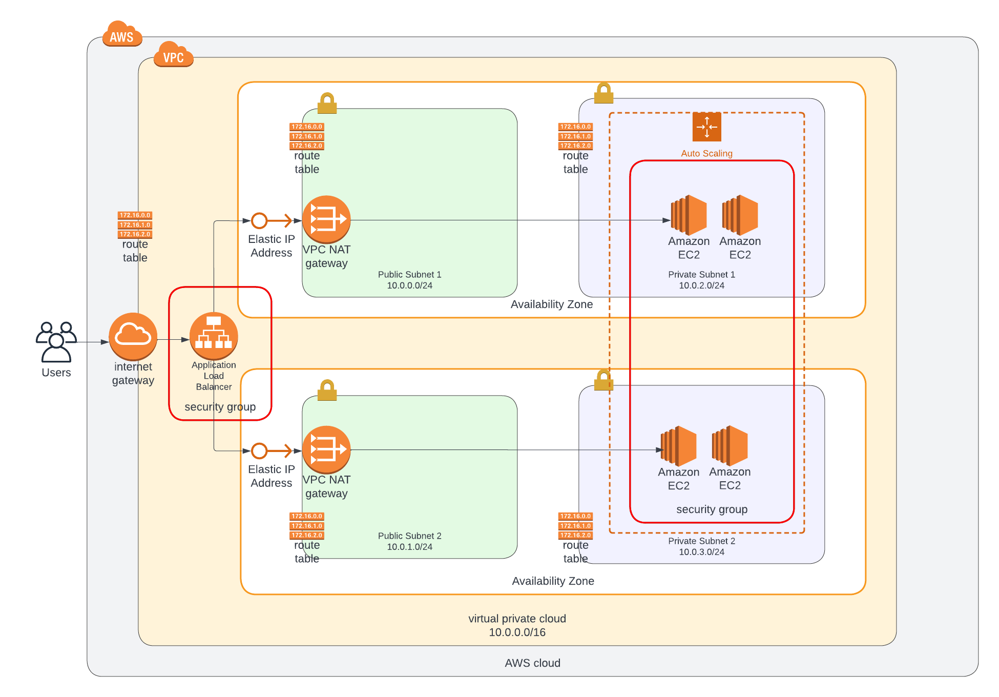

# **Deploy a high-availability web app using CloudFormation**


## **1. Set Servers parameters**
- **<span style="color:green">AMIofWebServer</span>**: AMI of web server *ex: ami-0ee23bfc74a881de5*
- **<span style="color:green">TypeOfWebServer</span>**: type of Web server *ex: t2.medium*
- **<span style="color:green">S3BucketName</span>**: S3 bucket name


## **2. Create project with the follwoing scripts**
* Creating Network Infrastructure
``` bash
./create.sh udagram-network network.yml network-parameters.json
```

* Creating Application Servers
``` bash
./create.sh udagram-servers servers.yml server-parameters.json
```

## **3. Web application url**
- From ***<span style="color:green">udagram-servers</span>*** stack find ***<span style="color:green">UdacityProject-LoadBalancerUrl</span>*** output catinaing Loadbalancer url for application

## **4. Delete project with the following scripts**
* Deleting Network Infrastructure
``` bash
./delete.sh udagram-network
```

* Deleting Application Servers
``` bash
./delete.sh udagram-servers
```
## **The follow is applicatin structure diagram**
